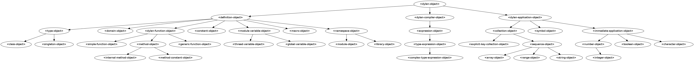

*******************
class-graph-builder
*******************

Generates .dot and .gml files for a class' hierarchy tree.

.. code-block:: bash

    class-graph-builder "<dylan-object>" environment-protocols

Then to generate a png from the .dot file:

.. code-block:: bash

    dot -Tpng dylan-object.dot > dylan-object.png

The result:

